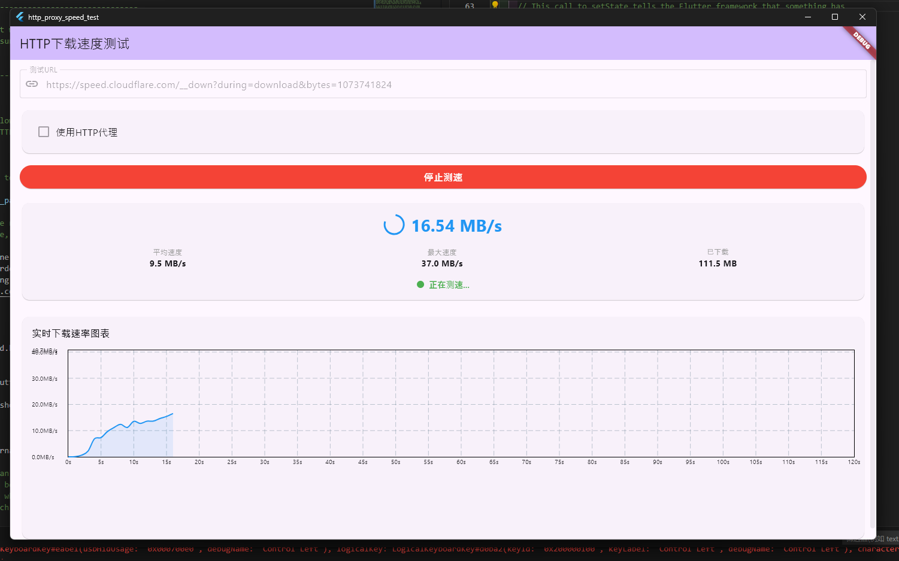

# HTTP Proxy Speed Test

一个跨平台的 HTTP 代理下载速度测试工具，支持直连与 HTTP 代理模式，可实时显示下载速度、平均速度、最大速度和总下载量，并绘制实时速度曲线。

## 功能特性
- 支持直连与 HTTP 代理模式
- 实时显示：
  - **当前速度**
  - **平均速度**
  - **最大速度**
  - **已下载数据量**
- 实时速度折线图
- 可自定义下载测试 URL
- 跨平台（Windows / macOS / Linux）

## 界面预览


## 使用方法

1. 下载并运行程序
2. 在输入框中填入测试 URL（默认为 Cloudflare 测速文件）
3. 可选：勾选 **使用HTTP代理** 并填写代理地址（格式：`http://ip:port`）
4. 点击 **开始测速**
5. 查看实时速度曲线及统计数据

## 编译方法

### 环境要求
- Flutter SDK (>=3.x)
- Dart SDK
- 已配置好目标平台构建环境

### 编译步骤
```bash
git clone https://github.com/yourname/http_proxy_speed_test.git
cd http_proxy_speed_test
flutter pub get
flutter run
